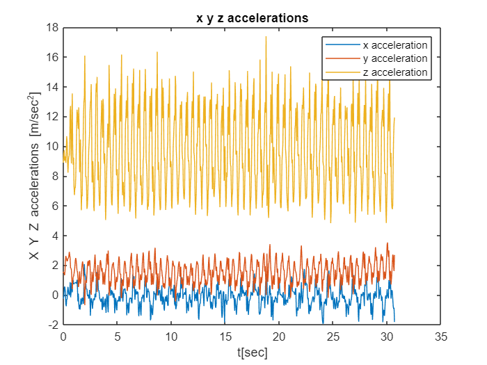
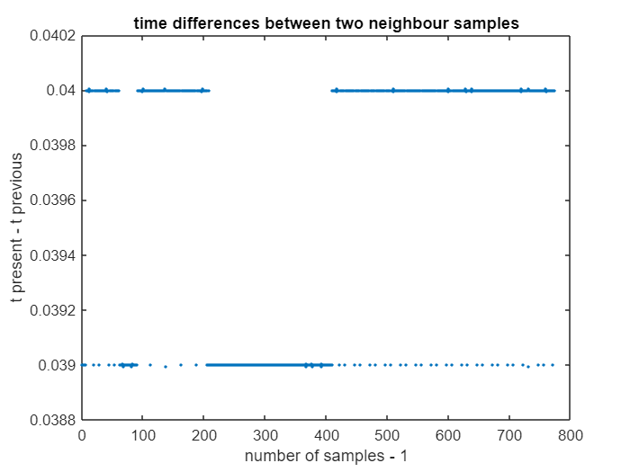
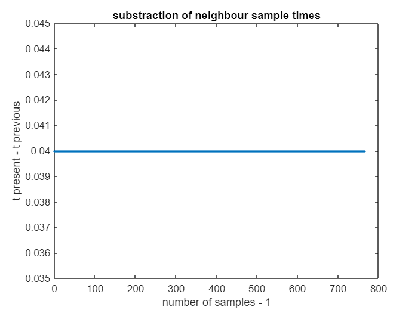
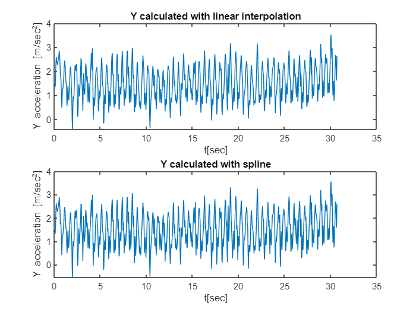
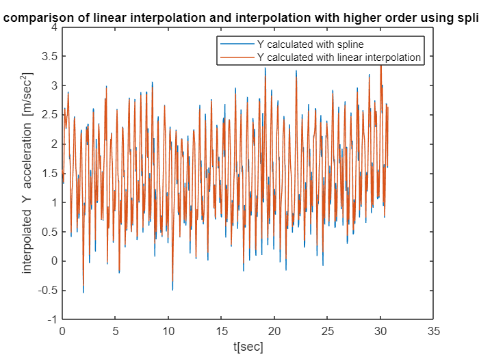
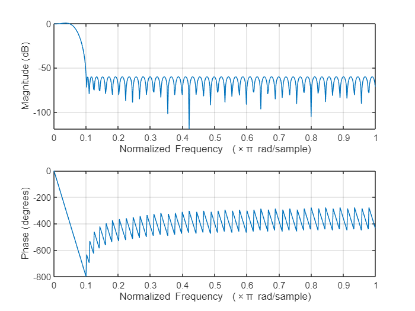
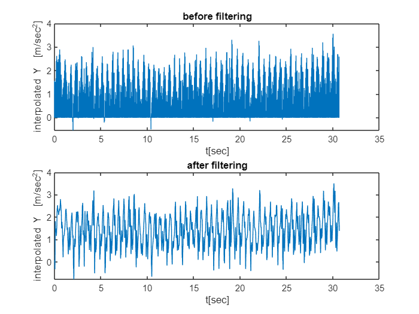
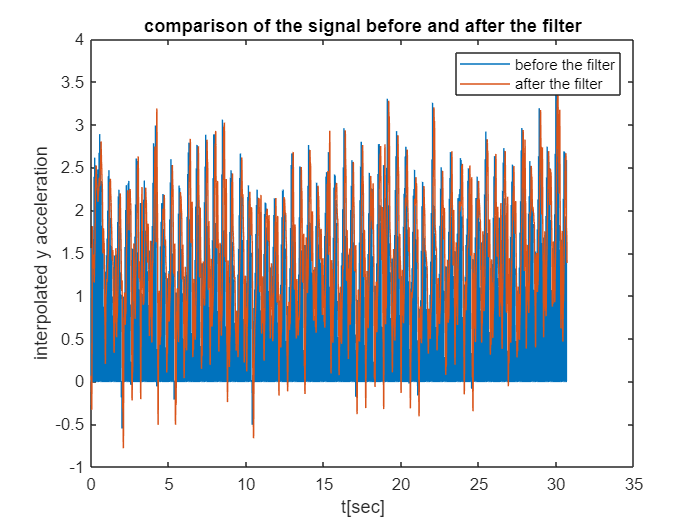
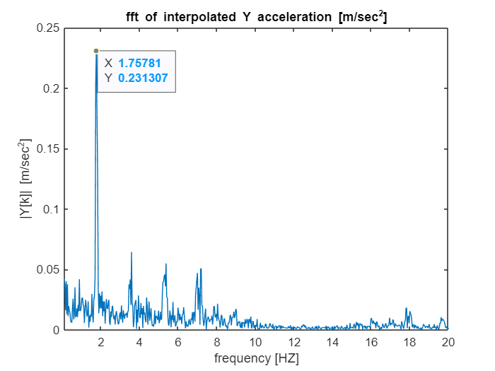

# **Project in Digital Signal Processing - calculating average step rate**

**Lecturer:**

Dr. Bykhovsky  Dmitry

**Submitors:**

Netanel Tochilovsky - 318729001

Oded puchinsky - 316003664

Michael Aronov - 316000751

# summary

As part of the project, we first performed an acceleration measurement in 3 different axes (X, Y and Z) using the mobile phone's acceleration sensor at a uniform predetermined sampling rate. Next, a set of values is selected from one of the axes through which we will base later. Then, due to the receipt of non-uniform time differences, we were required to perform a process of interpolation, which creates a function close to the original function, and through it we can obtain uniform differences. We will present two methods for performing this process. One using linear interpolation that can be implemented using a defined formula and the other will be performed directly using a dedicated command. Next, we increased the sampling frequency by frequency interpolation, first performing a set number of zeros between the samples (UPSAMPLING) and then designing a LOW PASS FILTER whose purpose is to filter out the noises generated as a result of increasing the sampling frequency. Finally, we performed, using another dedicated command, a fourier transformation of the signal, with the help of which we will perform the calculation of the required average step rate.

# Introduction

As part of the project in the course DSP, we will investigate the physical phenomenon of calculating a number of average step of walking along a final distance, when the electronic equipment that we will use is smartphone, when the data is received by the smartphone’s sensors, and the analysis and the data processing phases will be performed by using MATLAB software.

# Step 1 - recording our steps

we used the phone sensors to record 30.682 seconds of us walking to get information and process it. We held the phone in our hands horizontaly,and started walking, each step the phone measured a shake which in the end will be converted to a step.

We walked 54 steps in 30.682 seconds, which means that our  [$\frac{steps}{sec}$] = $\frac{54}{30.682}$ = 1.757 steps per second.

# Step 2 - choosing the data

The plots of the X Y Z accelerations and compare them to choose what we think will fit the best.

```matlab:Code
load('steps.mat');
t_ac = seconds(Acceleration.Timestamp - Acceleration.Timestamp(1)); % getting the vector of every sample time
x_ac = Acceleration.X; % getting the x acceleration from the data we got
y_ac = Acceleration.Y; % getting the y acceleration from the data we got
z_ac = Acceleration.Z; % getting the z acceleration from the data we got
figure(1) % plot all the graphs on the same graph for comparison
plot(t_ac,x_ac)
hold on
plot(t_ac,y_ac)
hold on
plot(t_ac,z_ac)
hold off
ylabel('X Y Z accelerations [m/sec^2]')
xlabel('t[sec]')
legend('x acceleration','y acceleration','z acceleration')
title('x y z accelerations')
```



## graph 1: The x,y,z accelerations from the phone sensors

```matlab:Code
clear x_ac z_ac % clearing the data we don't need
```

There are 3 signals printed on the graph, each of them is an output from a phone sensor.

We chose the Y acceleration because it has the best similiarity to a cycle signal and has the most logical acceleration piks (around 2 m/s^2 which is around 7.2 km/h) , this is because our hands stabilized the phone on the x and z axis.

The conclusion is that our phone measured with a few sensors, and we can use this measure to find our steps rate.

# Step 3 - linear and spline interpolation

Interpolation of the signal to get equal distanced sample times.

Because the signal we got was sampled with different time differences, we can't use fourier transform on it.

To fix this problem, we will use linear interpolation and interpolation of a higher order to transform our signal to a signal that has equal sample time difference.

# **a- manually linear interpolation**

First manually interpolate liniar interpolation to have even sampling times.

The sample frequency we chose is 25 HZ, because it is the frequency we measured in, and it has a comfortable power L for the interpolation to frequncy of 500 HZ.

**The problem: **

Sample times doesn't match. Because of it we can't apply fourier transform on the signal.

```matlab:Code
% linear interpolation manually
fs = 25;
Ts = 1/fs;
for i=2:length(t_ac) % calculating the substraction between two neighbour sampling points
    sub_t_ac(i-1) = t_ac(i)-t_ac(i-1);
end
figure(2) % plot the time differences between two neighbour samples
plot(sub_t_ac,'.')
title('time differences between two neighbour samples')
ylabel('t present - t previous')
xlabel('number of samples - 1')
```



## graph 2: The time difference between each two points in the signal we got

we see that the difference between each sample isnt always equal to the previous one.

**The solution:**

To fix the problem of unmatching sampling points we will use linear interpolation. 

first we will calculate what the actual sampling points should have been, and then we will fit it inside our signal.

between each two points, if the sampling time that should have been doesn't match the actual one, we will calculate the predicted value of the signal  using the equation: $Y_{predicted} =y_1 +\frac{y_2 -y_1 }{t_2 -t_1 }*(t-t_1 )$

when:

$(t_2 ,y_2 )$ - the second point that was sampled

$(t_1 ,y_1 )$ - the first point that was sampled

$(t,Y)$ - the point that we calculate, it is the time that the sample should have happened.

```matlab:Code
time_sample = 0:1/fs:t_ac(end); % the sampling times that should have been
for i=2:length(time_sample) % calculating the substraction between two neighbour sampling points
    sub_time_sample(i-1) = time_sample(i)-time_sample(i-1);
end
figure(3) % ploting the new time differences between two neighbour samples 
plot(sub_time_sample,'.')
title('substraction of neighbour sample times')
ylabel('t present - t previous')
xlabel('number of samples - 1')
ylim([0.035 0.045])
```



## graph 3: the fixed time samples differences

we see that now all the sampling times match each other.

the calculation of the Y acceleration with the matching sampling times.

```matlab:Code
k = 1; % a counter for the interpolaited y acceleration values
for i=2:length(t_ac)
    if time_sample(k) >= t_ac(i-1) && time_sample(k) <= t_ac(i) % if the true sampling is between two time variables then we calculate what it could be with linear interepolation
        y_lin(k) = y_ac(i-1) + ((y_ac(i)-y_ac(i-1))/(t_ac(i)-t_ac(i-1)))*(time_sample(k)-t_ac(i-1)); % calculate the fixed y using the formula of a linear equation
        k = k+1; % adding one to a counter
    end    
end
```

we will plot the interpolaited y acceleration in the next section and compare it to spline.

# **b - interpolation with spline**

Secondly we will use the command spline to compare the linear interpolation and an interpolation with equtions with higher order.

The spline command does the same as the linear interpolation, but with an equation with higher order:

$$
Y=a_0 +a_1 (y-y_1 )+a_2 (y-y_1 )^2 +a_3 (y-y_1 )^3
$$

```matlab:Code
% linear interpolation using spline command
y_sp = spline(t_ac,y_ac,time_sample); % the command for spline, (true sampling times,true y scores, what the sample time should have been)
figure(4) % ploting the two interpolaited y accelerations to see them next to each other

subplot(211) % y acceleration using linear interpolation
plot(time_sample,y_lin)
ylabel('Y acceleration [m/sec^2]')
xlabel('t[sec]')
title('Y calculated with linear interpolation')

subplot(212) % y acceleration using spline comman
plot(time_sample,y_sp)
ylabel('Y acceleration [m/sec^2]')
xlabel('t[sec]')
title('Y calculated with spline')
```



## graph 4: the y acceleration interpolated liniary and the y acceleration interpolated with spline next to each other

we see the graphs look similar to each other, so we will plot them together to compare them and see the differences. 

# **c- comparison of the interpolations**

```matlab:Code
figure(5) % the two interpolations on the same graph for comparison
plot(time_sample,y_sp,time_sample,y_lin)
ylabel('interpolated Y acceleration [m/sec^2]')
xlabel('t[sec]')
legend('Y calculated with spline','Y calculated with linear interpolation')
title('comparison of linear interpolation and interpolation with higher order using spline')
```



## graph 5: comparison between spline and linear interpolation

The graphs look almost identical. we chose the Y acceleration that was "fixed" with the spline command, because equation with a higher order gives us better accuracy at predicting the point we need, and the point will be closer to reality then the point that was calculated with linear interpolation.

```matlab:Code
clear Ts sub_time_sample sub_t_ac i k % clearing the variables we don't need
```

The conclusion is that both of the ways give us an equal sampled signal, but the spline signal is better fitted because it has higher order equation.

# Step 4 - Enlarging the sample frequency

To enlarge the sample frequency, we will need to interpolate the signal.

for the interpolation we need to do two things:

a - upsample the signal with power of L

b - pass the interpolated signal through a lowpass filter.

# **a- upsampling**

first we will upsample the signal with the factor of L.

we need to upsample it to the frequency of 500, our frequency is 25.

$$
L=\frac{500}{25}=20
$$

upsampling is inserting L-1 zeros between each sample, and in coclusion we will have L more times samples in the time domain.

The insertion of zeros make it part of the signal in the frequency domain.

Insertion of zeros will add interfirences because the signal will be L times smaller in the frequency domain.

```matlab:Code
new_fs = 500; % the new sampling frequency
L = new_fs/fs; % calculating power factor L
count = 1; % counter that will help with the interpolation
for i=1:length(y_sp) % interpolationg the y acceleration, after every value of the y acceleration that was calculated we will insert L-1 zeros
    for j=1:L
        if j == 1
            inter_y(count) = y_sp(i);
        else 
            inter_y(count) = 0;
        end
    count = count + 1;
    end
end
N = length(inter_y); % the number of the samples after interpolation
```

# **b - designing the FIR filter**

After the upsampling, our signal is L times smaller, and now it will be duplicated in the frequency domain and it will be counted as a distortion.

To fix it, we will pass the signal in a FIR filter, so only the real signal will pass.

To do it we will design a filter with the following features:

Amplifier of L, because our signal is L times smaller.

Frequency cut-off - $f_{cut-off} =\frac{\pi }{L}$

pass-band frequency - 0.05, which is $\frac{1}{L}$ because it is normalized by $\pi$ . 

stop-band frequency - 0.1.

we need to cut off the frequency at $f_{cut-off} =\frac{\pi }{L}$ because this is the frequency that the real signal ends, and after it the signal is duplicated.

```matlab:Code
figure(6)
```

```matlab:Code
% Design a digital filter
designedFilter = designfilt('lowpassfir', ...
    'PassbandFrequency',0.05,'StopbandFrequency',0.1, ...
    'PassbandRipple',1,'StopbandAttenuation',60);

% Visualize magnitude and phase responses
freqz(designedFilter.Coefficients)
```



## graph 6: the filter
# c- filtering the signal

```matlab:Code
y_filtered = L*filter(designedFilter,inter_y); % passing the interpolated y in the filter we designed
figure(7) % plotting the interpolated y acceleration before and after we pass it through a filter next to each other
subplot(211)
plot(linspace(0,t_ac(end),N),inter_y)
ylabel('interpolated Y  [m/sec^2]')
xlabel('t[sec]')
title('before filtering')
subplot(212)
plot(linspace(0,t_ac(end),N),y_filtered)
title('after filtering')
ylabel('interpolated Y  [m/sec^2]')
xlabel('t[sec]')
```



## graph 7: the interpolated signal before and after the filter, printed one next to the other

we see that before the filter are signal had a lot of noice and we cant even see our signal, but after we filtered it we could see the signal perfectly.

# d - comparison before and after filter

```matlab:Code
figure(8) % plotting the interpolated y acceleration before and after we pass it through a filter on the same graph for comparison
plot(linspace(0,t_ac(end),N),inter_y,linspace(0,t_ac(end),N),y_filtered)
ylabel('interpolated y acceleration')
xlabel('t[sec]')
title('comparison of the signal before and after the filter')
legend('before the filter','after the filter')
```



## graph 8: comparison between the signal before and after the filter

Before the filter the signal was uclear because of the interferences, but after we cleared it we could see the signal very clear.

we see that the filter works, and a lot of noice was attenuated.

The conclusion is that the filter attenuates most of the noice and we get back a clear signal, that was "sampled with higher frequency", and in the frequency domain we will get more points in the fft graph.

# Step 5 - fourier transform and calculation of steps per second

In the previous step we got our filtered interpolated signal,and the signal is periodic and has equal time differences, so we can apply fourier transform on it. 

Now we will apply DFT (Discrete Fourier Transform) on that signal to convert it into the frequency domain. After it is converted, because our signal is periodic and resembles a cos or sin wave, we will get a pik at the frequency of the periodic signal (just like  cos(f*t)) . This frequency that we will get is the frequency of our steps rate (with units of [$\frac{steps}{sec}$] ).

```matlab:Code
N2 = 0:N/2; % we will only look on half of the cycle, because fft will give us on the other half of the cycle duplicated symetric data that we don't need
Yk = fft(y_filtered,N); % discrete fourier transform to transform the signal to the frequency domain
figure(9) % ploting our filtered y signal in the frequency domain
plot(N2/N*new_fs,abs(Yk(N2+1))/N)
title('fft of interpolated Y acceleration [m/sec^2]')
ylabel('|Y[k]| [m/sec^2]')
xlabel('frequency [HZ]')
xlim([0.1,20]) % we will only look on a small scale of frequencies because the filter attenuates the rest of the frequencies
```



## graph 9: the signal after the fft

```matlab:Code
[peak,location] = max(abs(Yk(N2+2))/N); % finding the peak
frequency = N2./N*new_fs;
steps_per_second = frequency(location+1);
```

As expected, we got a graph in the frequency domain with a peak of a periodic signal. The peak is at f = 1.75, which is exactly what we expected.

T[sec] = $\frac{1}{f}$

$\frac{steps}{sec}=$ $steps*\frac{1}{T}$ = $steps*f$ - every second we take f steps.

We see that our step rate is 1.757[$\frac{steps}{sec}$].

The step rate we got is exactly what we expected.

```matlab:Code
fprintf('our steps per second is: %.2f\n',steps_per_second)
```

```text:Output
our steps per second is: 1.76
```

The conclusion is that we can get the frequency of our signal with the fft graph, the frequency will have the biggest peak and it will be the amount of steps we took each second.

# Summary and conclusions

At this project we measured our steps using our phone,we walked for half a minute and the sensors of the phone was transmitted it into the matlab drive. We imported the information from the matlab drive to our code and with the help of spline interpolation we fitted our signal to an equally sampled signal.With frequency interpolation and an FIR filter we increased our sampling points in the frequency domain, and with fft we calculated the steps per second. 

The conclusions we made:

   1.   If  the sampling time margine isn't equal between every two points, we can't use fft. 
   1.  To fix the unmatching margine we can use linear interpolation or spline, which will give us well sampled signal. 
   1.  Spline is better than linear interpolation, but not by much. 
   1.  We can enlarge our sampling frequency using frequency interpolation, which will give us more points in the frequency domain, but won't change our real signal. 
   1.  After the interpolation we get a signal that has a lot of noice inside it, and the solution is using a filter. 
   1.  To correctly fix the interpolation, we need to use a filter with pass-band frequency of 1/L(power of interpolation), this will allow only the real signal to pass the filter. 
   1.  Once we have the fft of interpolated signal, we can see a peak of our periodic signal, and the frequency of that peak is showing us our steps per second. 
   1.  Because we held the phone horizontaly with both our hands (just like writing a message while we walk), the phone measured each shake we made while we walked, each step our body and especially our hands shake a little when our foot lands the ground, and the Y axis feels it the most, because our hands stabilize the phone on the x and z axis. So every step we take our phone feels it, and in the end the frequency we get is for each step, because the periodic signal is every step we take. 

# Bibliography

[https://bykhov.github.io/dsp/DSP_Book.pdf](https://bykhov.github.io/dsp/DSP_Book.pdf) - Lecture book of DSP course in SCE.

[https://www.mathworks.com/help/matlab/ref/spline.html](https://www.mathworks.com/help/matlab/ref/spline.html) - spline command explenation

[https://www.mathworks.com/help/signal/ref/designfilter.html?searchHighlight=designfilter\&s_tid=srchtitle_designfilter_2](https://www.mathworks.com/help/signal/ref/designfilter.html?searchHighlight=designfilter&s_tid=srchtitle_designfilter_2) - Explanation of DesignFilter command.

[https://www.mathworks.com/help/matlab/ref/filter.html](https://www.mathworks.com/help/matlab/ref/filter.html) - explanation of filter command.
